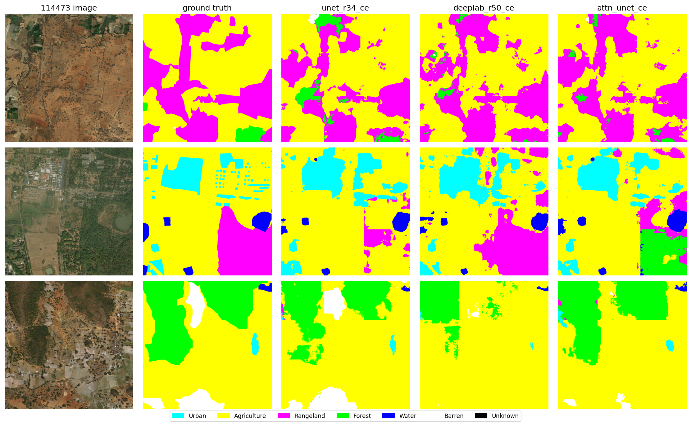
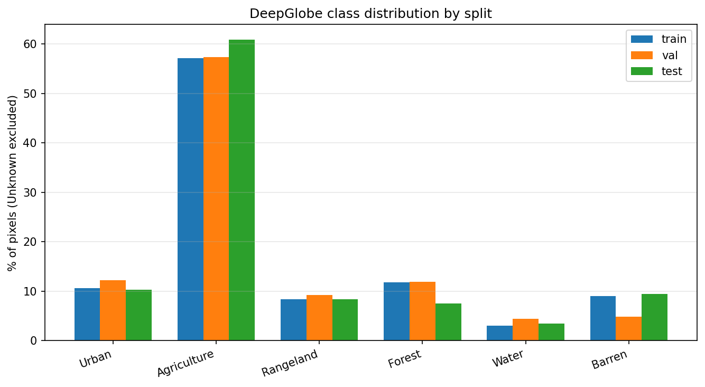
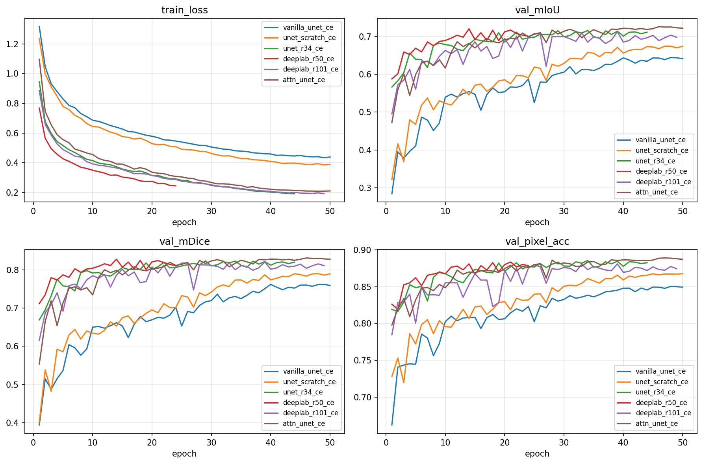
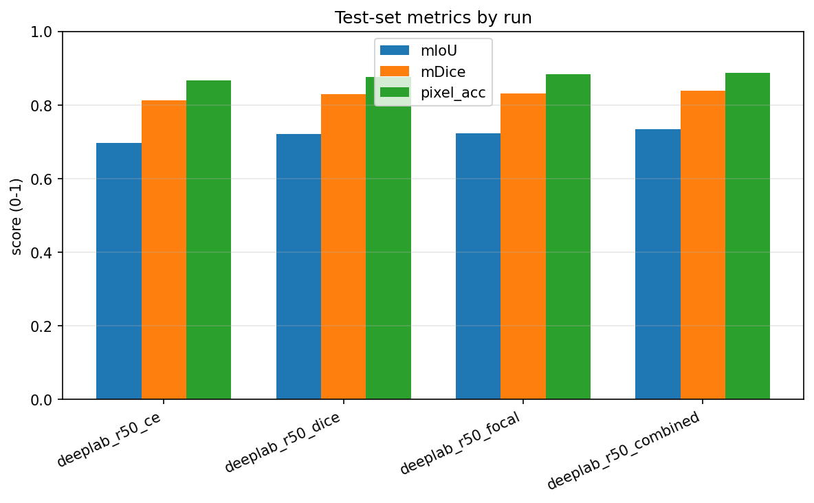
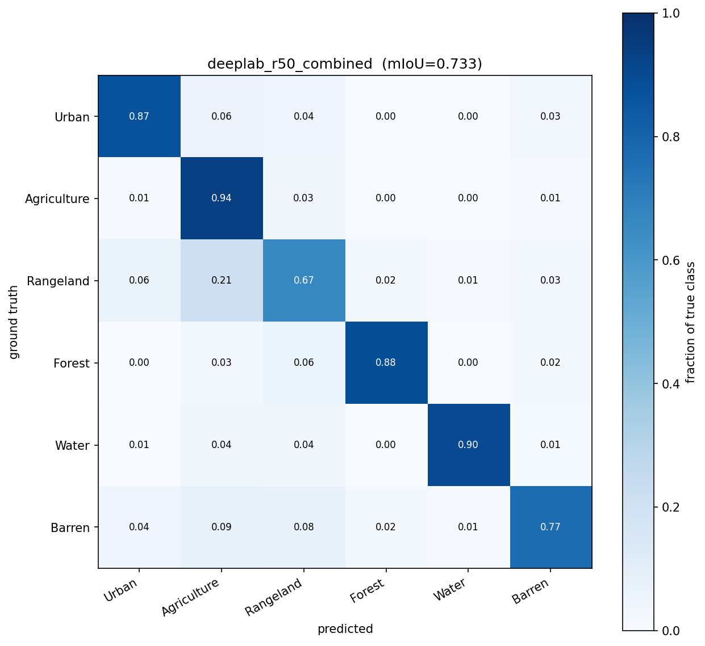

# DeepGlobe Land-Cover Segmentation

**An Empirical Study of Architectures, Transfer Learning, and Loss Functions for 2448×2448 Satellite Imagery**

[](writeup/report.tex)
[](writeup/slides.tex)
[](notebooks/colab_run.ipynb)
[](src/)

> Nine controlled experiments that isolate the effects of network architecture, ImageNet pre-training, and loss function on the DeepGlobe Land Cover benchmark. The best configuration — **DeepLabV3+-R50 with a Combined CE+Dice loss** — reaches **0.7332 test mIoU** on full-resolution (2448×2448) reconstructions.

<p align="center">
  
</p>

---

## TL;DR

| What we varied | Isolated effect on test mIoU |
|---|---|
| ImageNet pre-training (architecture held fixed) | **+4.1 pp** |
| Any single decoder swap among pre-trained models | ≤ +1.0 pp |
| Cross-Entropy → Combined CE+Dice loss (architecture held fixed) | **+3.7 pp** |
| Barren-class IoU under the same loss switch | **+2.0 pp** |
| ResNet101 vs ResNet50 (test) | +0.022 *(within noise)* |
| Vanilla U-Net → best pipeline (all factors combined) | **+9.3 pp** |

**Headline.** On a long-tailed 7-class segmentation problem, the two biggest levers are *data* (ImageNet pre-training) and *loss rebalancing* (Combined CE+Dice), not decoder depth. A ResNet101 encoder offers no Pareto improvement over ResNet50.

---

## Dataset

**DeepGlobe Land Cover Classification** — 803 manually annotated RGB satellite images at 2448×2448, 7 classes (Urban, Agriculture, Rangeland, Forest, Water, Barren, Unknown).

Splits are assigned at the **image level** to prevent tile leakage across train/val/test: 562 / 121 / 120 images. Unknown pixels are treated as `ignore_index` throughout loss and metric computation, matching the official DeepGlobe protocol.

<p align="center">
  
</p>

The distribution is heavily imbalanced — Agriculture dominates (~55 %), while Barren and Water together account for < 7 % of pixels. This motivates the loss-function comparison in Phase 5.

---

## Method

**Tiling pipeline.** Each 2448² image is split into a 3×3 grid of 816² tiles for training (5,058 tiles total). At test time, a sliding window (816² tile with 64-pixel overlap) reconstructs the full 2448² prediction, averaging softmax probabilities in overlapping regions before `argmax`.

**Padding.** Because 816 mod 32 = 16, tiles are reflect-padded to 832² at input and center-cropped at output so that 5-stage encoders (ResNet34/50/101) see a valid shape. Padded mask pixels carry the Unknown label and are masked from the loss.

**Training.** AdamW (lr = 10⁻⁴, wd = 10⁻⁴), cosine annealing over 50 epochs, mixed-precision fp16, early stopping with patience 10. Batch size 8 (reduced to 4 for ResNet101 due to GPU memory). Augmentations: horizontal/vertical flip, 90° rotation, ±15° affine, brightness/contrast jitter, Gaussian noise (Albumentations). Compute: a single A100 40 GB on Colab Pro+, ≈ 15 GPU-hours total for all nine runs.

---

## Results

### Phase 4 — architecture, fixed loss (Cross-Entropy)

| Model | Params | Val mIoU | Test mIoU | Train time |
|---|---:|---:|---:|---:|
| Vanilla U-Net (scratch)                  | 31.04 M | 0.6442 | 0.6402 | 3.53 h |
| U-Net + ResNet34 (scratch)               | 24.44 M | 0.6743 | 0.6750 | 2.00 h |
| U-Net + ResNet34 (ImageNet)              | 24.44 M | 0.7156 | 0.7093 | 1.76 h |
| DeepLabV3+ + ResNet50 (ImageNet)         | 26.68 M | 0.7201 | 0.6963 | **0.97 h** |
| DeepLabV3+ + ResNet101 (ImageNet)        | 45.67 M | 0.7124 | 0.7178 | 2.32 h |
| Attention U-Net + ResNet34 (ImageNet)    | 24.55 M | **0.7259** | **0.7316** | 2.20 h |

### Phase 5 — loss, fixed architecture (DeepLabV3+-R50, the Phase 4 speed leader)

| Loss | Val mIoU | Test mIoU | Barren IoU | Rangeland IoU |
|---|---:|---:|---:|---:|
| Cross-Entropy (baseline)              | 0.7201 | 0.6963 | 0.656 | 0.415 |
| Dice                                  | 0.7314 | 0.7214 | 0.666 | 0.443 |
| Focal (α = 0.25, γ = 2)               | 0.7286 | 0.7217 | 0.667 | 0.451 |
| **Combined (0.5 CE + 0.5 Dice)**      | **0.7382** | **0.7332** | **0.676** | **0.454** |

All Phase 5 metrics are computed on full-resolution (2448 × 2448) reconstructions of the 120 test images.

---

## Three findings

### 1 · Pre-training dominates the single-variable effects

<p align="center">
  
</p>

Holding architecture fixed (U-Net + ResNet34), initializing from ImageNet weights contributes **+4.1 mIoU** versus training from scratch. Any single decoder swap among pre-trained models contributes at most **+1.0 mIoU**. Pre-trained runs cross 0.60 mIoU in ≤ 3 epochs; scratch runs require 12–20 epochs to reach the same threshold.

### 2 · Loss rebalancing complements the architecture gain

<p align="center">
  
</p>

On the same DeepLabV3+-R50 backbone, replacing Cross-Entropy with a Combined CE+Dice loss raises **test mIoU by +3.7 pp** and **Barren-class IoU by +2.0 pp**. Stacked with the architecture upgrade from Vanilla U-Net, the total Barren-class gain over the weakest baseline reaches **+10.5 pp** — a decisive improvement on the rarest non-ignored class.

### 3 · A deeper encoder is not Pareto-dominant

| | ResNet50 | ResNet101 |
|---|---:|---:|
| Parameters           | 26.68 M | 45.67 M (+ 71 %) |
| Val mIoU             | **0.7201** | 0.7124 (− 0.008) |
| Test mIoU            | 0.6963 | **0.7178** (+ 0.022) |
| Train time           | **0.97 h** | 2.32 h (2.4 ×) |
| Inference latency    | **838 ms** | 891 ms |

Both the validation deficit and the test-set gain fall within single-seed variance. The extra 71 % parameters and 2.4 × training cost of ResNet101 are not justified by a non-significant test-set improvement.

---

## Best-model analysis

<p align="center">
  
</p>

Final configuration: **DeepLabV3+-R50 + Combined (CE + Dice)**. **Test mIoU = 0.7332** on full-resolution reconstructions of the 120 test images. The dominant residual error is Rangeland → Agriculture confusion, consistent with the two classes' overlapping spectral and textural signatures in RGB satellite imagery. Failure cases (see `writeup/figs/failures_combined.png`) cluster at mixed-use boundaries and small urban-water pixels that fall below the spatial resolution of per-tile context.

---

## Reproducing the results

The full pipeline is pre-wired in a Colab notebook:

```
notebooks/colab_run.ipynb   →  open in Colab, mount Drive, run all cells
```

Local (requires a CUDA GPU):

```bash
git clone https://github.com/Jerryzhang258/landcover-seg
cd landcover-seg
pip install -r requirements.txt

python scripts/prepare_tiles.py          # tile + image-level split
bash   scripts/run_all_archs.sh          # Phase 4: six architectures
bash   scripts/run_all_losses.sh         # Phase 5: four losses on winner
bash   scripts/eval_all.sh               # Phase 6: full-resolution eval
```

Expected wall-clock on a single A100 40 GB: ≈ 15 GPU-hours for all nine training runs plus ≈ 2 hours for full-resolution evaluation.

---

## Repository layout

```
src/
├── tiling.py          # tile / stitch / sliding window with overlap averaging
├── dataset.py         # TileDataset, FullImageDataset
├── augment.py         # Albumentations pipeline (+ reflect-pad to 832²)
├── models.py          # Vanilla U-Net + segmentation_models.pytorch factory
├── losses.py          # CE / Dice / Focal / Combined (all with ignore_index = 6)
├── metrics.py         # Confusion-matrix → mIoU / Dice / per-class IoU
├── train.py           # Training loop (AMP + cosine LR + early stopping + W&B)
├── eval_fullres.py    # Full-resolution sliding-window evaluation
└── utils.py           # DeepGlobe RGB ↔ label codec, class constants, seeding

configs/               # One YAML per experiment; all inherit base.yaml
scripts/               # prepare_tiles, plot_*, run_*.sh, aggregate_results
writeup/               # report.tex, slides.tex, figures
notebooks/colab_run.ipynb   # End-to-end Colab runner
tests/                 # pytest: tiling round-trip, metrics, utils, models
```

---

## Writeup

- **Technical report** — [`writeup/report.tex`](writeup/report.tex) (≈ 6 pages)
- **Presentation slides** — [`writeup/slides.tex`](writeup/slides.tex) (Beamer, 15-minute talk)
- **Compilation instructions** — [`writeup/README.md`](writeup/README.md)

Both documents are ready to compile on Overleaf; drag-and-drop `writeup.zip` to reproduce the PDFs.

---

## Citation

```bibtex
@misc{zhang2026landcoverseg,
  title  = {Deep Learning-Based Land Cover Segmentation from Satellite Imagery:
            An Empirical Study of Architectures, Transfer Learning, and Loss Functions},
  author = {Zhang, Rongxuan},
  year   = {2026},
  note   = {Final project, EECE 7370 Advanced Computer Vision, Northeastern University},
  url    = {https://github.com/Jerryzhang258/landcover-seg}
}
```

---

## Acknowledgments

This project was carried out as the final project for **EECE 7370 Advanced Computer Vision** at **Northeastern University**. Training ran on Google Colab Pro+ (single A100 40 GB). Experiment tracking used [Weights & Biases](https://wandb.ai). Segmentation backbones and pre-trained weights are provided by [`segmentation_models.pytorch`](https://github.com/qubvel/segmentation_models.pytorch).
